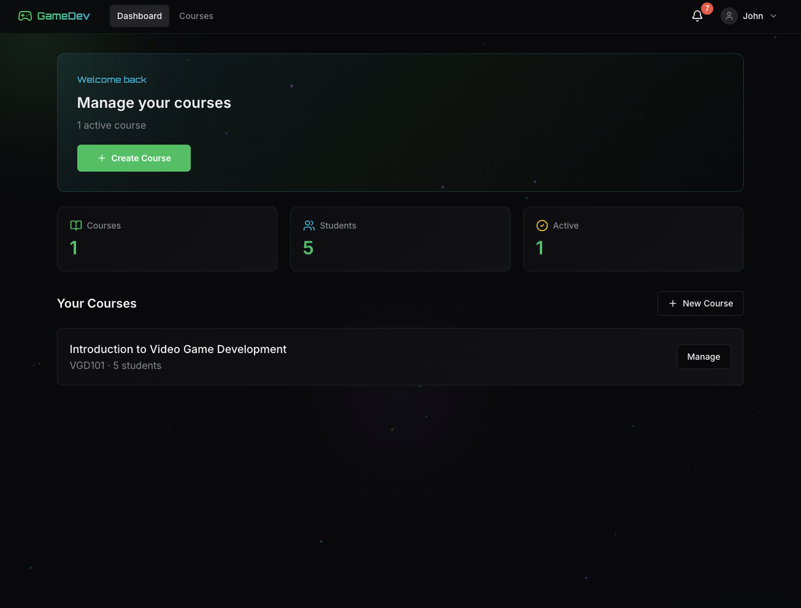
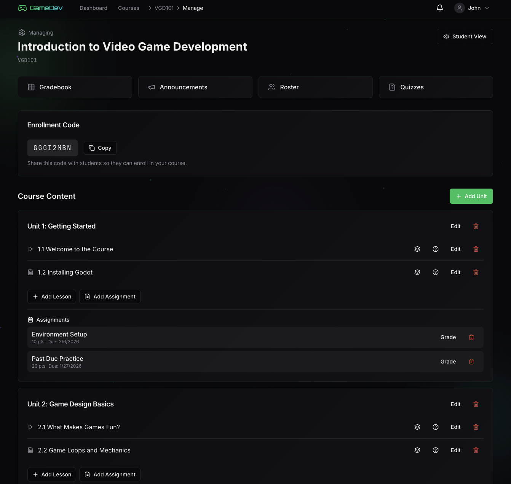
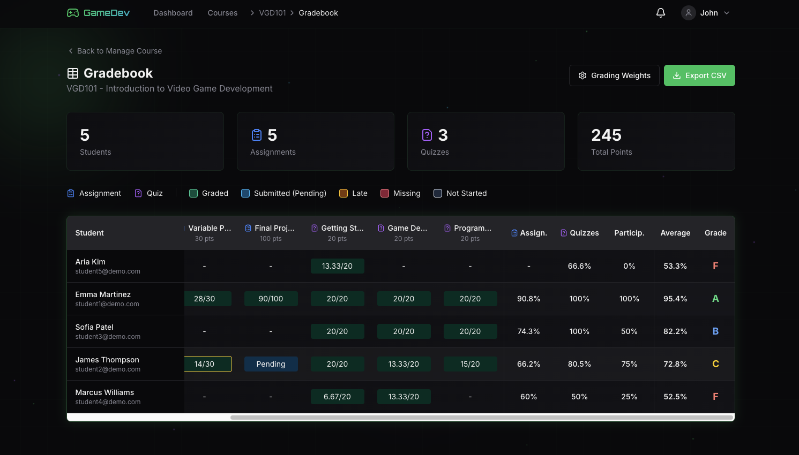
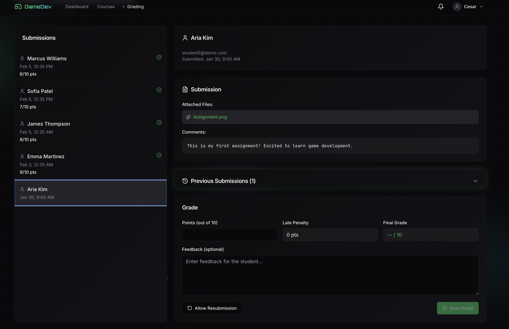
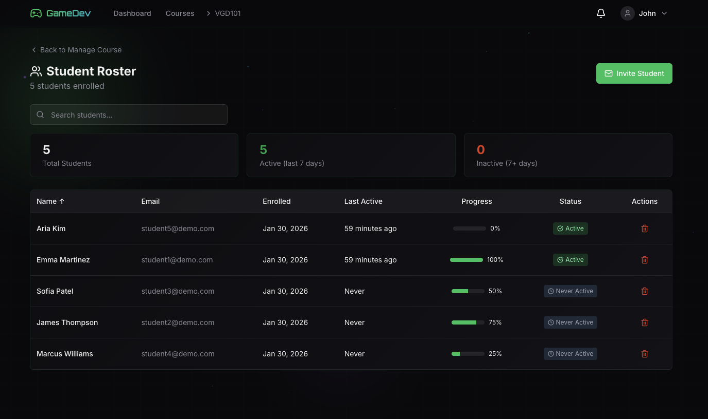

# GameDev Learning Platform

A full-stack Learning Management System (LMS) built for video game development education, featuring real-time notifications, immersive learning mode, and comprehensive course management.



## Features

### For Students
- **Immersive Learning Mode** - Distraction-free course player with video lessons, markdown content, and progress tracking
- **Real-time Notifications** - Instant updates for grades, announcements, and deadlines via WebSockets
- **Quiz System** - Auto-graded multiple choice quizzes with attempt tracking
- **Assignment Submissions** - File uploads with late submission policies
- **Progress Tracking** - Resume videos exactly where you left off

### For Instructors
- **Course Builder** - Create courses with units, lessons, and embedded videos
- **Gradebook** - Matrix view with inline grading and CSV export
- **Student Roster** - Track activity, send invitations, manage enrollments
- **Announcements** - Pin important updates, optional email notifications
- **Quiz Builder** - Create questions with configurable attempts and passing scores

## Tech Stack

| Layer | Technology |
|-------|------------|
| **Frontend** | React 18, TypeScript, Vite, Tailwind CSS, Framer Motion |
| **Backend** | Django 4.2 LTS, Django REST Framework, Django Channels |
| **Database** | PostgreSQL 16 |
| **Real-time** | Redis, WebSockets |
| **Auth** | JWT tokens, django-allauth, dj-rest-auth |
| **DevOps** | Docker, Docker Compose |

## Screenshots

<details>
<summary>Click to expand screenshots</summary>

### Course Management

*Instructor course builder with units, lessons, and content management*

### Gradebook

*Instructor gradebook with inline editing and CSV export*

### Grading Interface

*Assignment grading with feedback and late penalty support*

### Student Roster

*Student roster with activity tracking and enrollment management*

</details>

## Architecture

```
┌─────────────────────────────────────────────────────────────┐
│                        Frontend                              │
│  React 18 + TypeScript + Tailwind + Framer Motion           │
└─────────────────────────┬───────────────────────────────────┘
                          │ REST API + WebSocket
┌─────────────────────────┴───────────────────────────────────┐
│                        Backend                               │
│  Django REST Framework + Django Channels                     │
├──────────────────┬──────────────────┬───────────────────────┤
│   PostgreSQL     │      Redis       │    File Storage       │
│   (Data Store)   │   (WebSocket)    │   (Media/Uploads)     │
└──────────────────┴──────────────────┴───────────────────────┘
```

### Key Design Decisions

- **Django Channels for WebSockets** - Real-time notifications without polling, scalable with Redis backend
- **JWT Authentication** - Stateless auth with refresh tokens for better security
- **Role-based Access Control** - Instructor vs student permissions enforced at API level
- **Enrollment Codes** - Secure course access without requiring instructor approval for each student

## Quick Start

### Prerequisites
- Docker & Docker Compose

### Run with Docker

```bash
# Clone the repository
git clone https://github.com/Cesar6060/dev-learning-platform.git
cd dev-learning-platform

# Start all services
docker-compose up

# Access the application
# Frontend: http://localhost:5173
# Backend API: http://localhost:8000/api
# Admin Panel: http://localhost:8000/admin
```

### Demo Accounts

Seed the database with demo data:

```bash
docker-compose exec backend python manage.py seed_data
```

| Role | Email | Password |
|------|-------|----------|
| Instructor | instructor@demo.com | password123 |
| Student | student1@demo.com | password123 |

## API Overview

The platform exposes a RESTful API with 40+ endpoints:

| Resource | Endpoints | Description |
|----------|-----------|-------------|
| Auth | 8 | Registration, login, password reset, user settings |
| Courses | 12 | CRUD, enrollment, units, lessons |
| Assignments | 6 | Submissions, grading, file uploads |
| Quizzes | 10 | Questions, attempts, auto-grading |
| Gradebook | 3 | Matrix view, export, quick grade |
| Notifications | 4 | Real-time via WebSocket + REST fallback |

## Project Structure

```
gamedev-platform/
├── backend/
│   ├── accounts/        # User model, auth, preferences
│   ├── courses/         # Courses, units, lessons, progress
│   ├── assignments/     # Assignments, submissions, grades
│   ├── quizzes/         # Quiz engine with auto-grading
│   └── notifications/   # WebSocket consumers, notification model
├── frontend/
│   ├── src/
│   │   ├── components/  # 50+ reusable UI components
│   │   ├── pages/       # Route pages (student & instructor views)
│   │   ├── contexts/    # Auth, Theme, Notification contexts
│   │   └── services/    # API service layer
│   └── ...
└── docker-compose.yml
```

## Development Highlights

### Security
- Admin-only instructor promotion (no self-registration as instructor)
- Enrollment codes prevent unauthorized course access
- File upload validation and size limits
- CORS and CSRF protection

### Performance
- Video progress saved on pause/seek (debounced)
- Optimistic UI updates for better perceived performance
- Lazy loading for course content

### UX Polish
- Framer Motion animations throughout
- Keyboard navigation in learning mode
- Toast notifications for async actions
- Responsive design with mobile support

## What I Learned

- **WebSocket Architecture** - Implementing real-time features with Django Channels and handling connection lifecycle
- **State Management** - Balancing React Context vs component state for auth, theme, and notifications
- **API Design** - Structuring RESTful endpoints for complex nested resources (courses → units → lessons)
- **Docker Development** - Creating a reproducible dev environment with hot-reload for both frontend and backend

## Future Enhancements

- [ ] Discussion forums for peer support
- [ ] Instructor analytics dashboard
- [ ] Certificate generation on course completion
- [ ] Mobile app with React Native

## License

MIT License - feel free to use this as a reference for your own projects.

---

**Built by Cesar Villarreal** | [GitHub](https://github.com/Cesar6060)
