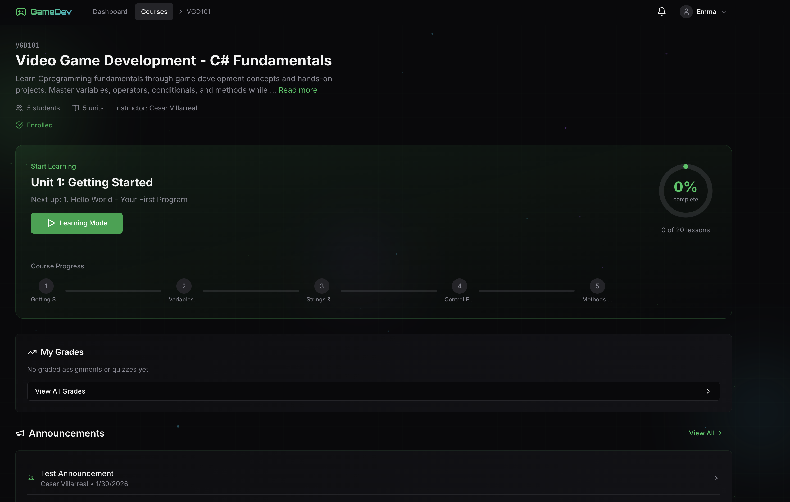
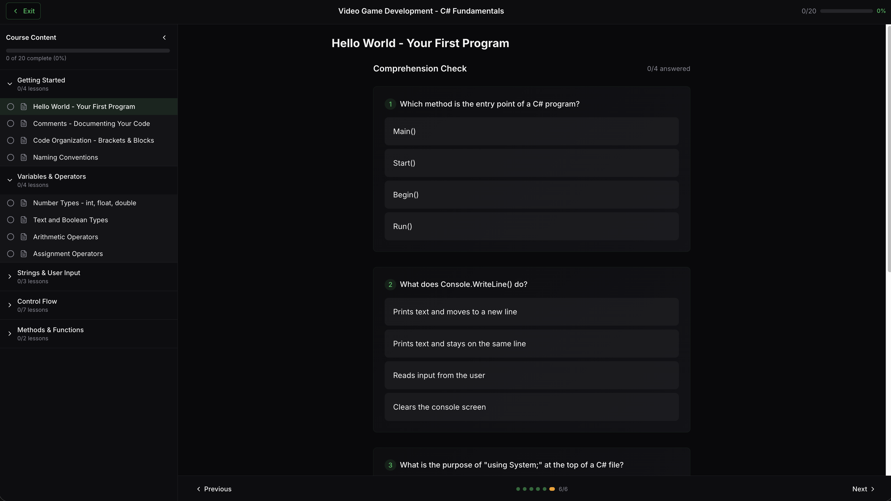

# STEM Quest

[](https://github.com/Cesar6060/LMS/actions/workflows/ci.yml)

A full-stack Learning Management System for Computer Science education, deployed and running in production. Students work through paginated lessons in an immersive learning mode, pass mastery-style comprehension quizzes, and earn XP and badges; instructors build courses, grade, and track their roster.

**Live app:** <https://stemquest.cesarvillarreal11.workers.dev>
**API:** <https://stemquest-api.onrender.com>

### Try it

Log in with the public demo account:

| | |
|---|---|
| **Email** | `jdoe@demo.com` |
| **Password** | `Admin123!` |

The demo account is a student enrolled in **JAVA101 (Introduction to Java)** with Unit 1 completed and Unit 2 in progress — poke around freely; it resets to that baseline periodically. The first request may take up to a minute if the free-tier backend happens to be cold.


## Features

### For Students
- **Immersive Learning Mode** — distraction-free course player with paginated sections, embedded video, and markdown content
- **Mastery Quizzes** — comprehension checks that re-queue missed questions until every one is answered correctly, plus auto-graded unit quizzes with attempt limits
- **Gamification** — XP, levels, streaks, badges, and a customizable mascot
- **Progress Tracking** — pick up exactly where you left off, down to the section and video position
- **Discussions** — course-level threads and replies

### For Instructors
- **Course Builder** — courses → units → lessons → sections, with embedded videos and file attachments
- **Gradebook** — matrix view with inline grading and CSV export
- **Student Roster** — activity tracking, invitations, enrollment management
- **Announcements** — pinned updates with optional email notifications
- **Quiz Builder** — configurable attempts, passing scores, and per-lesson comprehension checks

## Screenshots

### Student Experience


*Course catalog and enrollment*


*Immersive learning mode with paginated lesson content*

<details>
<summary>Instructor views (demo account is student-only — expand to see the other half)</summary>

### Course Management

*Instructor course builder with units, lessons, and content management*

### Gradebook

*Instructor gradebook with inline editing and CSV export*

### Grading Interface

*Grading with feedback support*

### Student Roster

*Student roster with activity tracking and enrollment management*

</details>

## Production Architecture

Every service runs on a free tier, each picked to do one job well:

```
    Browser
      |  loads JS/CSS from        Cloudflare Workers (frontend, global CDN)
      |  images/files from        Cloudflare R2      (media storage)
      |  API calls to             Render             (Django + gunicorn)
      |                             |
      |                             +-- Neon          (serverless Postgres)
      |
      +-- errors reported to      Sentry       (frontend + backend projects)
          uptime watched by       UptimeRobot  (incl. keep-warm ping)
```

- **Cloudflare Workers** serves the built React app as static assets from a global CDN, auto-deploying on every push to `main`.
- **Render** runs the Django API with gunicorn; WhiteNoise serves the admin's static files so no separate CDN is needed. Deploys are gated on a health check.
- **Neon** hosts Postgres with compute that sleeps when idle — the shallow `/api/health/` endpoint deliberately skips the DB so the keep-warm ping doesn't hold it awake, while an hourly deep check (`?deep=1`) proves Django can actually reach it.
- **Cloudflare R2** stores user uploads (avatars, attachments) via `django-storages`, because Render's free-tier filesystem is wiped on every deploy.
- **Sentry** tracks errors in two projects (`stemquest-django`, `stemquest-react`) with release tagging, readable stack traces via hidden source maps, and PII scrubbed.
- **UptimeRobot** answers "is the site down?" with three monitors; its 5-minute ping doubles as the keep-warm that prevents free-tier cold starts.
- **GitHub Actions** runs pytest, `tsc`, ESLint, and a production Vite build on every PR — a red run blocks the merge, and both hosts deploy whatever lands on `main`.

Deep dives: [deployment overview](docs/specs/deployment-overview.md) · [deployment runbooks](docs/runbooks/)

## Tech Stack

| Layer | Technology |
|-------|------------|
| **Frontend** | React 18, TypeScript, Vite, Tailwind CSS, Framer Motion |
| **Frontend hosting** | Cloudflare Workers (static assets, global CDN) |
| **Backend** | Django 4.2 LTS, Django REST Framework, gunicorn, WhiteNoise |
| **Backend hosting** | Render |
| **Database** | PostgreSQL 16 (Neon serverless in production) |
| **Media storage** | Cloudflare R2 via django-storages |
| **Auth** | JWT tokens, django-allauth, dj-rest-auth |
| **Observability** | Sentry (both halves), UptimeRobot |
| **CI/CD** | GitHub Actions; git-push deploys to Render + Cloudflare |
| **Local dev** | Docker Compose (production runs no containers) |

## Local Development

### Prerequisites
- Docker & Docker Compose

### Run with Docker

```bash
# Clone the repository
git clone https://github.com/Cesar6060/LMS.git
cd LMS

# Start all services
docker compose up

# Access the application
# Frontend: http://localhost:5173
# Backend API: http://localhost:8000/api
# Admin Panel: http://localhost:8000/admin
```

### Local Demo Accounts

The live site's `jdoe@demo.com` login above is managed separately (see
`seed_demo_account`). For **local development only**, seed a full set of
demo data:

```bash
docker compose exec backend python manage.py seed_data
```

Then log in at http://localhost:5173/login:

| Role | Email | Password |
|------|-------|----------|
| Instructor | instructor@demo.com | `Admin123!` |
| Student | student1@demo.com … student5@demo.com | `Admin123!` |

> **Never run `seed_data` against production.** It creates courses and a
> pile of demo users. The only command safe to point at the production
> database is `seed_demo_account`, which touches nothing but the jdoe
> demo account.

## Project Structure

```
├── backend/
│   ├── accounts/        # Custom user model, auth, preferences
│   ├── courses/         # Courses, units, lessons, sections, progress
│   ├── quizzes/         # Unit quiz engine with auto-grading
│   ├── discussions/     # Course threads and replies
│   ├── gamification/    # XP, levels, streaks, badges, mascot
│   └── notifications/   # In-app notification feed
├── frontend/
│   ├── src/
│   │   ├── components/  # Reusable UI components
│   │   ├── pages/       # Route pages (student & instructor views)
│   │   ├── contexts/    # Auth, Theme, Notification contexts
│   │   └── services/    # API service layer
│   └── ...
└── docker-compose.yml   # Local dev only
```

## Key Design Decisions

- **JWT Authentication** — stateless auth with refresh tokens
- **Role-based Access Control** — instructor vs student permissions enforced at the API level, backed by a per-endpoint permission test suite
- **Enrollment Codes** — secure course access without per-student instructor approval
- **Env-gated production behavior** — R2, Sentry, and production DB config all activate only via environment variables, so local dev and CI stay inert
- **Mastery-based comprehension checks** — missed questions re-queue until answered correctly; first-try answers are what get scored

## License

MIT License — feel free to use this as a reference for your own projects.

---

**Built by Cesar Villarreal** | [GitHub](https://github.com/Cesar6060)
